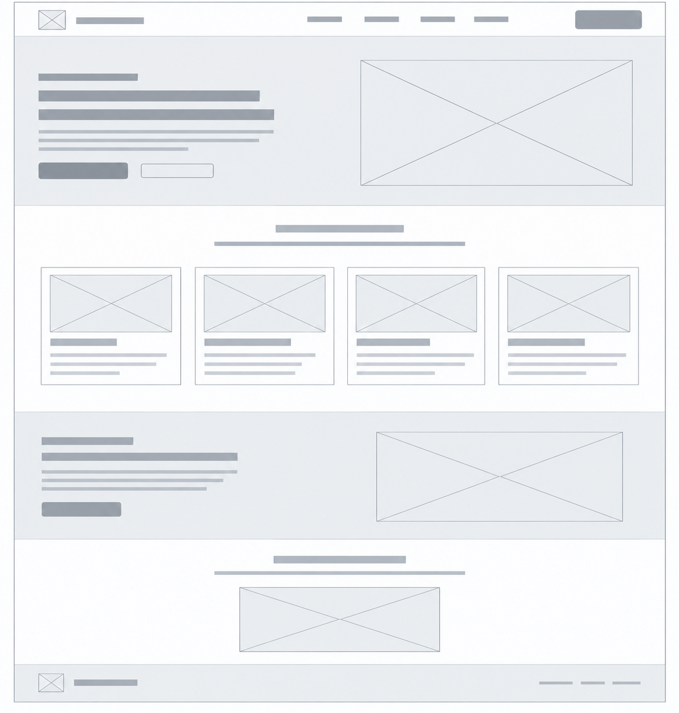
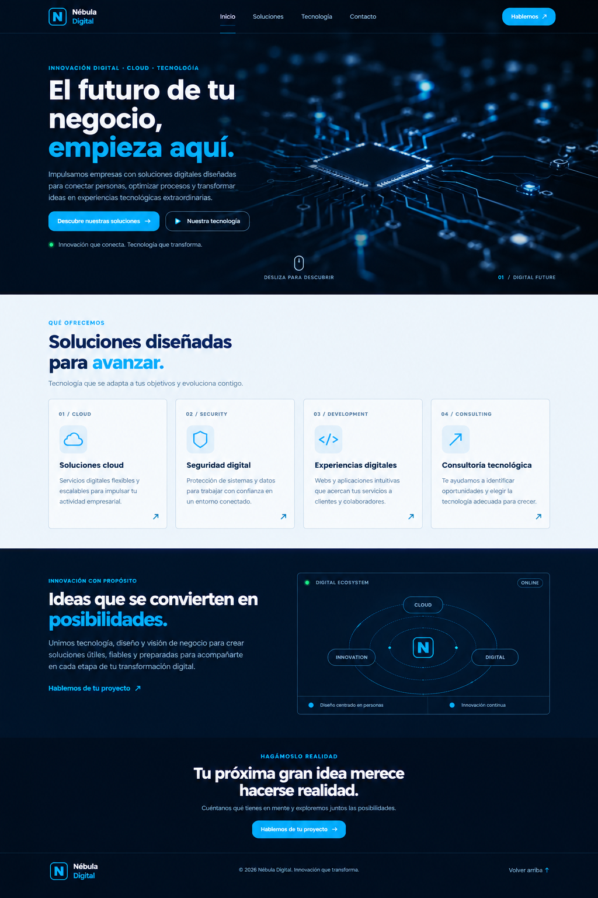
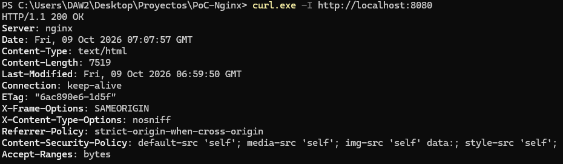
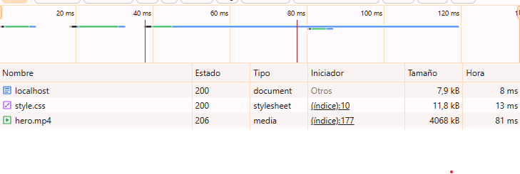
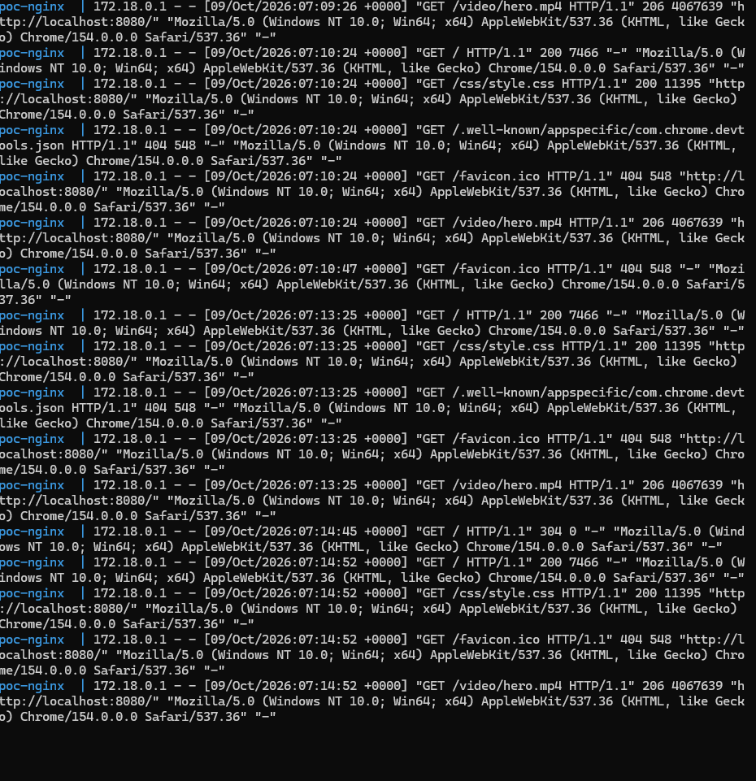

# PoC de Infraestructura: Nginx con Docker

## 1. Descripción del proyecto

Despliegue de una landing page estática mediante Nginx dentro de un contenedor Docker, utilizando Docker Compose para gestionar el servicio.

El objetivo es servir contenido estático, configurar un Virtual Host y aplicar medidas básicas de *hardening*.

La página web desarrollada corresponde a **Nébula Digital**, una marca ficticia orientada a ofrecer soluciones tecnológicas, servicios cloud, seguridad digital, desarrollo de experiencias web y consultoría tecnológica. El desarrollo de la web se plantea como un proyecto realizado por una empresa tecnológica para uno de sus clientes.

La interfaz presenta una estética tecnológica moderna, basada en fondos azul marino, acentos azul eléctrico, tipografía sans-serif y una composición visual estructurada en secciones.

## 2. Arquitectura

La infraestructura utiliza Docker para ejecutar Nginx de forma aislada y Docker Compose para definir la configuración del servicio.

```text
Navegador del usuario
        |
        | HTTP: localhost:8080
        v
Puerto 8080 del host (Windows)
        |
        | Mapeo de puertos 8080:80
        v
Contenedor Docker: poc-nginx
        |
        v
Nginx escuchando en el puerto 80
        |
        v
Archivos estáticos: HTML, CSS y vídeo
```

El puerto 8080 del equipo anfitrión se redirige al puerto 80 del contenedor, donde Nginx atiende las peticiones HTTP.

## 3. Estructura del proyecto

```text
PoC-Nginx/
├── conf/
│   └── default.conf
├── html/
│   ├── index.html
│   ├── css/
│   │   └── style.css
│   └── video/
│       └── hero.mp4
├── img/
│   ├── Captura1.png
│   ├── Captura2.png
│   ├── Captura3.png
│   ├── Wireframe.png
│   └── Mockup.png
├── docker-compose.yml
└── README.md
```

- `html/`: contiene los archivos estáticos de la página web.
- `html/index.html`: estructura y contenido de la landing page.
- `html/css/style.css`: estilos visuales, tipografía, colores y distribución.
- `html/video/`: contiene el vídeo utilizado como fondo de la cabecera principal.
- `conf/default.conf`: contiene la configuración del servidor Nginx.
- `docker-compose.yml`: define el servicio, la imagen, los puertos y los volúmenes.
- `img/`: almacena las capturas de validación y los documentos visuales de diseño.

## 4. Tecnologías utilizadas

- Docker y Docker Compose.
- Nginx `1.27-alpine`.
- HTML5.
- CSS3.
- Windows 11 y PowerShell.
- Markdown para la documentación técnica.

## 5. Diseño de la interfaz

### 5.1. Wireframe

El wireframe representa la estructura y jerarquía de los elementos de la página antes de definir su diseño visual definitivo. Su objetivo es establecer la distribución de las secciones, los bloques de contenido, las imágenes y los elementos de navegación.

Se utiliza una representación de baja fidelidad, sin colores de marca, imágenes definitivas, iconos decorativos ni contenido textual final. Los elementos se representan mediante bloques y líneas de referencia.



La estructura definida incluye:

1. **Cabecera o navbar:** ubicación del logotipo, navegación principal y botón de contacto.
2. **Hero:** área principal de presentación, con espacio para el titular, descripción, botones de acción y recurso visual de fondo.
3. **Servicios:** sección de cuatro tarjetas distribuidas horizontalmente.
4. **Innovación y tecnología:** sección dividida en dos columnas, con contenido descriptivo y un panel visual.
5. **Contacto:** llamada a la acción centrada para facilitar el contacto con la empresa.
6. **Footer:** identificación de marca, información de copyright y navegación secundaria.

El wireframe permite validar la organización general de la página y la jerarquía de sus elementos antes de aplicar los estilos definitivos.

### 5.2. Mockup

El mockup representa la propuesta visual de alta fidelidad de la landing page. Define la identidad gráfica, la paleta cromática, la tipografía, la apariencia de los componentes y el tratamiento visual de cada sección.



La propuesta utiliza un diseño tecnológico y minimalista, con contraste entre secciones oscuras y claras, acentos azul eléctrico y elementos gráficos relacionados con el entorno digital.

**Nota:** las especificaciones siguientes constituyen la guía visual de referencia para implementar el mockup en CSS. Los valores son una definición de diseño propuesta; las dimensiones definitivas deben contrastarse con el archivo `style.css` y con la versión renderizada de la web.

#### 5.2.1. Identidad visual

- **Marca:** Nébula Digital.
- **Estilo:** tecnológico, moderno, minimalista y profesional.
- **Personalidad:** innovación, confianza, precisión y evolución digital.
- **Logotipo:** símbolo geométrico con la inicial `N`, acompañado del nombre de marca.
- **Recurso visual principal:** vídeo tecnológico con circuitos electrónicos, oscurecido mediante una capa superpuesta para garantizar la legibilidad del contenido.

#### 5.2.2. Paleta de colores

Los colores se definen mediante códigos HEX para mantener la coherencia visual entre secciones, componentes y estados de interacción.

| Token | Color | Código HEX | Aplicación |
|---|---|---|---|
| `--color-primary` | Azul marino | `#061426` | Fondo principal y secciones oscuras |
| `--color-primary-dark` | Azul casi negro | `#020914` | Navbar, hero y footer |
| `--color-secondary` | Azul medio | `#0B2A4A` | Superficies secundarias y paneles |
| `--color-accent` | Azul eléctrico | `#12A8FF` | Botones principales, enlaces y énfasis |
| `--color-accent-hover` | Azul intenso | `#008FE0` | Estado hover de botones y enlaces |
| `--color-surface` | Gris azulado muy claro | `#F3F8FD` | Fondo de la sección de servicios |
| `--color-card` | Blanco | `#FFFFFF` | Tarjetas de servicios |
| `--color-border` | Azul grisáceo claro | `#D5E3F0` | Bordes de tarjetas y divisores claros |
| `--color-border-dark` | Azul grisáceo oscuro | `#1E3954` | Bordes y separadores sobre fondos oscuros |
| `--color-text` | Blanco azulado | `#F4F8FF` | Titulares sobre fondos oscuros |
| `--color-text-dark` | Azul marino | `#102B4C` | Titulares sobre fondos claros |
| `--color-text-secondary` | Gris azulado | `#A9BDD2` | Párrafos sobre fondos oscuros |
| `--color-text-muted` | Gris azulado oscuro | `#55708D` | Párrafos y etiquetas sobre fondos claros |
| `--color-success` | Verde turquesa | `#32D6A0` | Indicadores de estado y disponibilidad |

**Criterios de aplicación:**

- Los fondos oscuros se reservan principalmente para el hero, la sección tecnológica, el contacto y el footer.
- La sección de servicios utiliza un fondo claro para crear una separación visual y mejorar la lectura de las tarjetas.
- El azul eléctrico identifica las acciones principales, los enlaces y las palabras destacadas en los titulares.
- Los textos secundarios utilizan tonos menos intensos, manteniendo contraste suficiente con el fondo.
- El verde turquesa se utiliza únicamente en indicadores de estado, sin competir con el color principal de interacción.

#### 5.2.3. Tipografía

La familia tipográfica de referencia es **Montserrat**, una tipografía sans-serif adecuada para una interfaz tecnológica, con titulares geométricos y buena legibilidad.

- **Familia principal:** `Montserrat`.
- **Familias de respaldo:** `Arial`, `sans-serif`.
- **Origen previsto:** Google Fonts, si se decide cargar la fuente desde ese servicio.
- **Uso:** titulares, navegación, botones, párrafos y etiquetas.

| Elemento | Tamaño | Interlineado | Peso |
|---|---:|---:|---|
| H1 — titular principal | `64px` | `1.05` | `800` |
| H2 — título de sección | `40px` | `1.15` | `700` |
| H3 — título de tarjeta | `20px` | `1.3` | `700` |
| H4 — subtítulo auxiliar | `18px` | `1.4` | `600` |
| Texto principal | `16px` | `1.8` | `400` |
| Texto de tarjeta | `14px` | `1.6` | `400` |
| Navegación | `14px` | `1.4` | `500` |
| Botones | `14px` | `1.4` | `600` |
| Etiquetas superiores | `11px` | `1.5` | `700` |
| Microtexto y estados | `10px` | `1.5` | `500` |

Los tamaños de H1 y H2 corresponden a la propuesta para escritorio. Deben reducirse en dispositivos pequeños mediante media queries para evitar desbordamientos y conservar una jerarquía tipográfica adecuada.

**Pesos tipográficos:**

- `400 — Regular`: párrafos y textos descriptivos.
- `500 — Medium`: navegación, etiquetas y textos secundarios.
- `600 — SemiBold`: botones y subtítulos.
- `700 — Bold`: títulos de sección y tarjetas.
- `800 — ExtraBold`: titular principal del hero.

#### 5.2.4. Sistema de espaciado y distribución

Se utiliza una escala de espaciado basada en múltiplos de 4 px para mantener la consistencia entre secciones y componentes.

| Token | Valor | Uso |
|---|---:|---|
| `--space-1` | `4px` | Separación mínima |
| `--space-2` | `8px` | Elementos relacionados |
| `--space-3` | `12px` | Separación de etiquetas y textos |
| `--space-4` | `16px` | Espaciado interno habitual |
| `--space-6` | `24px` | Separación entre elementos |
| `--space-8` | `32px` | Bloques de contenido |
| `--space-12` | `48px` | Separación entre grupos |
| `--space-16` | `64px` | Espaciado entre secciones |
| `--space-20` | `80px` | Márgenes verticales amplios |

**Distribución de referencia en escritorio:**

- Ancho máximo del contenido: `1440px`.
- Márgenes laterales: `5%` aproximadamente, ajustables al ancho de pantalla.
- Padding vertical de secciones: entre `80px` y `100px`.
- Separación entre tarjetas: `20px`.
- Separación entre columnas de las secciones divididas: entre `48px` y `64px`.
- Altura del navbar: aproximadamente `88px`.
- Ancho de texto del hero: entre `480px` y `600px`, según el tamaño de pantalla.

Estos valores son referencias para la implementación, no mediciones certificadas de la captura final.

#### 5.2.5. Bordes, radios y sombras

| Propiedad | Valor de referencia | Aplicación |
|---|---|---|
| Grosor de borde | `1px solid` | Tarjetas, paneles y divisores |
| Radio de tarjetas | `6px` | Tarjetas de servicios |
| Radio de botones | `8px` | Acciones principales y secundarias |
| Radio de paneles | `10px` | Panel tecnológico |
| Radio de indicadores | `50%` | Puntos de estado |
| Sombra de tarjeta | `0 8px 24px rgba(0, 0, 0, 0.08)` | Elevación sutil cuando proceda |
| Transición | `200ms ease` | Hover y cambios de estado |

El diseño prioriza bordes discretos y sombras contenidas, evitando efectos que resten protagonismo al contenido.

#### 5.2.6. Componentes de interfaz

**Navbar**

- Fondo azul marino oscuro, con transparencia si se mantiene el efecto del mockup.
- Logotipo con la inicial `N` dentro de un contorno azul eléctrico.
- Navegación horizontal con enlaces de tamaño `14px`.
- Botón de contacto alineado a la derecha.
- Separador inferior de `1px` para delimitar la cabecera.

**Botón principal**

- Fondo: `#12A8FF`.
- Texto: `#FFFFFF`.
- Tipografía: `14px`, peso `600`.
- Padding de referencia: `12px 20px`.
- Radio: `8px`.
- Hover: transición hacia `#008FE0`.

**Botón secundario**

- Fondo transparente.
- Borde: `1px solid #55708D`.
- Texto: `#F4F8FF`.
- Tipografía: `14px`, peso `600`.
- Padding de referencia: `12px 20px`.
- Hover: fondo azul medio con contraste suficiente.

**Tarjetas de servicios**

- Fondo: `#FFFFFF`.
- Borde: `1px solid #D5E3F0`.
- Radio: `6px`.
- Padding de referencia: `24px`.
- Etiqueta superior: `11px`, peso `700`.
- Icono sobre una superficie azul muy clara.
- Título: `20px`, peso `700`.
- Descripción: `14px`, interlineado `1.6`.
- Enlace de acción situado en la esquina inferior derecha.

**Panel tecnológico**

- Fondo: `#0B2A4A` o una variante oscura coherente con la sección.
- Borde: `1px solid #1E3954`.
- Radio: `10px`.
- Elementos gráficos mediante órbitas, nodos y líneas finas.
- Indicadores de estado en azul eléctrico y verde turquesa.

**Enlaces de texto**

- Color principal: `#12A8FF`.
- Peso: `600`.
- Decoración opcional al pasar el cursor.
- Transición de color de `200ms ease`.

#### 5.2.7. Especificación de las secciones

**1. Hero**

- Navbar integrado en la parte superior.
- Vídeo tecnológico de fondo con reproducción automática, sin sonido y en bucle.
- Capa oscura superpuesta para mejorar la legibilidad.
- Etiqueta superior en mayúsculas.
- Titular H1 con una palabra o frase destacada en azul eléctrico.
- Descripción breve.
- Dos botones de acción.
- Indicador de estado y elemento visual de desplazamiento.

**2. Servicios**

- Fondo claro `#F3F8FD`.
- Título y descripción alineados a la izquierda.
- Cuatro tarjetas en una cuadrícula horizontal en escritorio.
- Cada tarjeta incluye categoría, icono, título, descripción y enlace.
- En pantallas pequeñas, las tarjetas deben reorganizarse en una o dos columnas.

**3. Innovación y tecnología**

- Fondo azul marino.
- Distribución en dos columnas.
- Texto descriptivo y enlace en la columna izquierda.
- Panel gráfico con un nodo central y elementos tecnológicos en la derecha.
- En pantallas pequeñas, las columnas se apilan verticalmente.

**4. Contacto**

- Fondo oscuro.
- Contenido centrado.
- Etiqueta superior, titular, descripción y botón principal.
- Jerarquía visual enfocada en facilitar la conversión.

**5. Footer**

- Fondo oscuro.
- Logotipo a la izquierda.
- Información de copyright centrada o alineada según el espacio disponible.
- Enlace para volver al inicio.
- Separador superior discreto.

#### 5.2.8. Diseño responsive

La interfaz debe adaptarse a diferentes anchos de pantalla sin perder contenido ni funcionalidad.

| Dispositivo | Ancho de referencia | Comportamiento esperado |
|---|---|---|
| Escritorio amplio | `1200px` o más | Navbar horizontal y cuatro tarjetas en una fila |
| Portátil | `992px–1199px` | Ajuste de márgenes y espacios; tarjetas adaptables |
| Tablet | `768px–991px` | Dos columnas de servicios y secciones más compactas |
| Móvil | Menos de `768px` | Una columna, tipografía reducida y botones adaptados |
| Móvil pequeño | Menos de `480px` | Padding reducido y textos ajustados al ancho |

Los puntos de ruptura son valores de referencia y deben ajustarse a la composición real del CSS.

En móvil se debe garantizar:

- Ausencia de desplazamiento horizontal no deseado.
- Titulares con tamaños adaptados.
- Botones suficientemente grandes para la interacción táctil.
- Navegación accesible, mediante menú adaptado si no cabe en una sola fila.
- Vídeo de fondo optimizado y alternativa visual cuando no se pueda reproducir.
- Orden lógico de los contenidos al apilar columnas.

#### 5.2.9. Accesibilidad y usabilidad

- Uso de etiquetas semánticas HTML5: `header`, `nav`, `main`, `section` y `footer`.
- Jerarquía coherente de encabezados.
- Textos alternativos para las imágenes informativas.
- Etiquetas accesibles para enlaces cuyo propósito no resulte evidente.
- Contraste suficiente entre texto y fondo.
- Indicadores visibles de foco para la navegación mediante teclado.
- Estados hover y focus diferenciados.
- El vídeo de fondo no debe incluir sonido y debe respetar las preferencias de movimiento reducido.
- Los elementos interactivos deben ser utilizables con teclado y lectores de pantalla.

La accesibilidad final debe comprobarse sobre la implementación real, no únicamente sobre el mockup.

#### 5.2.10. Criterios de fidelidad del mockup

La implementación se considerará visualmente alineada con la propuesta cuando:

1. Se respeten la paleta cromática y los roles de cada color.
2. Se mantengan las jerarquías tipográficas y los pesos definidos.
3. Las secciones conserven su orden y distribución.
4. Los botones, tarjetas, paneles y enlaces mantengan estilos coherentes.
5. Los márgenes y espacios sean consistentes.
6. La web funcione correctamente en escritorio y móvil.
7. Los recursos visuales no perjudiquen la legibilidad.
8. Los elementos interactivos mantengan un comportamiento accesible.

## 6. Configuración y medidas de hardening

La configuración del servidor se encuentra en `conf/default.conf`.

Se han aplicado las siguientes medidas:

- **Ocultación de la versión:** `server_tokens off` evita mostrar la versión de Nginx en las respuestas de error.
- **Protección frente a iframes:** `X-Frame-Options: SAMEORIGIN` restringe la inserción de la página en marcos de otros orígenes.
- **Protección MIME:** `X-Content-Type-Options: nosniff` evita que el navegador interprete los recursos como tipos distintos de los declarados.
- **Política de referencias:** `Referrer-Policy: strict-origin-when-cross-origin` limita la información de referencia enviada en solicitudes entre orígenes.
- **Política de seguridad de contenido:** `Content-Security-Policy` restringe los orígenes permitidos para determinados recursos.
- **Volúmenes de solo lectura:** los archivos web y la configuración se montan con `:ro`, evitando su modificación desde el contenedor a través de esos montajes.

Además, se utiliza la directiva `try_files` para servir los recursos existentes y devolver un error 404 cuando la ruta solicitada no se encuentra.

## 7. Despliegue y gestión del servicio

Para iniciar el servicio en segundo plano:

```powershell
docker compose up -d
```

Para comprobar el estado del contenedor:

```powershell
docker compose ps
```

Para consultar los registros de Nginx:

```powershell
docker compose logs -f web
```

Para acceder a la shell del contenedor:

```powershell
docker compose exec web sh
```

Para detener el servicio y eliminar el contenedor:

```powershell
docker compose down
```

La aplicación está disponible en:

`http://localhost:8080`

## 8. Validación del despliegue

### 8.1. Comprobación de la respuesta HTTP

Se utiliza el siguiente comando para comprobar que el servidor responde correctamente y revisar las cabeceras HTTP:

```powershell
curl.exe -I http://localhost:8080
```

La respuesta obtenida fue `HTTP/1.1 200 OK`. También se verificó la presencia de las cabeceras de seguridad configuradas.



### 8.2. Comprobación desde el navegador

Se accedió a la aplicación desde el navegador y se utilizaron las herramientas de desarrollo, en la pestaña *Network*, para comprobar la carga de la página y de sus recursos estáticos.

Se verificó la respuesta de los recursos HTML, CSS y vídeo.



### 8.3. Comprobación de los logs

Se consultaron los registros del servicio mediante:

```powershell
docker compose logs -f web
```

Al acceder y recargar la página desde el navegador, se observaron las peticiones recibidas por Nginx y sus correspondientes códigos de respuesta.



## 9. Incidencia simulada

**Pendiente de realizar en la siguiente sesión.**

Se realizará el diagnóstico de una incidencia simulada que produzca una respuesta HTTP 403 o 404. Para ello, se revisarán los logs de Nginx, los archivos y permisos dentro del contenedor y la configuración del servidor.

Los resultados y la solución aplicada se documentarán una vez realizada la actividad.

## 10. Conclusiones

La práctica permite desplegar una web estática mediante Nginx y Docker, comprender el funcionamiento de los puertos publicados y los volúmenes, y aplicar medidas básicas de hardening a un servidor web.

La documentación del wireframe y el mockup complementa la parte de infraestructura con la definición de la estructura y el diseño visual de la interfaz, estableciendo criterios para mantener la coherencia gráfica y facilitar futuras modificaciones.
